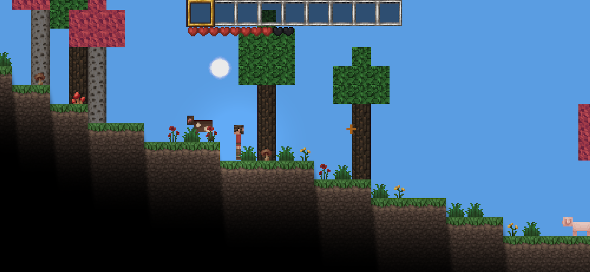
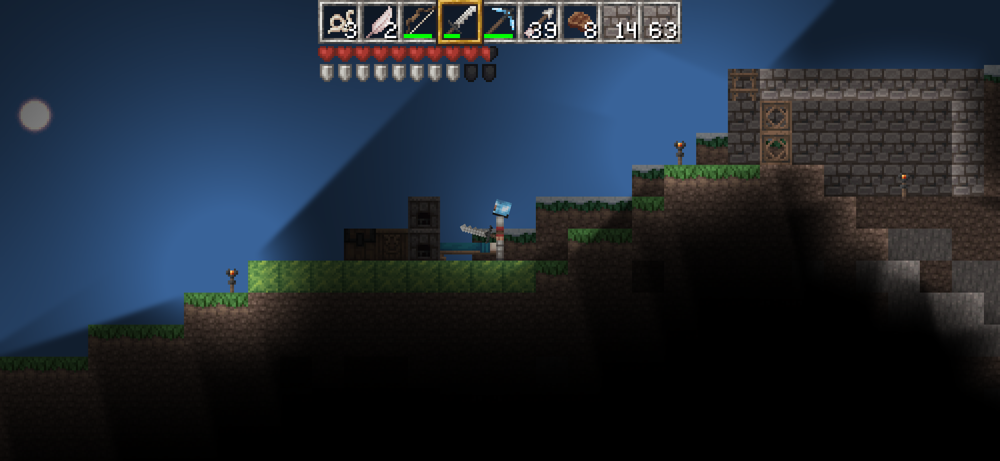
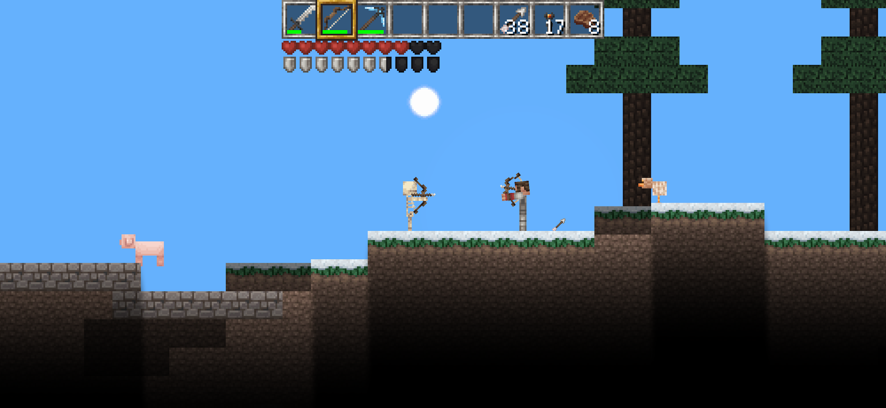
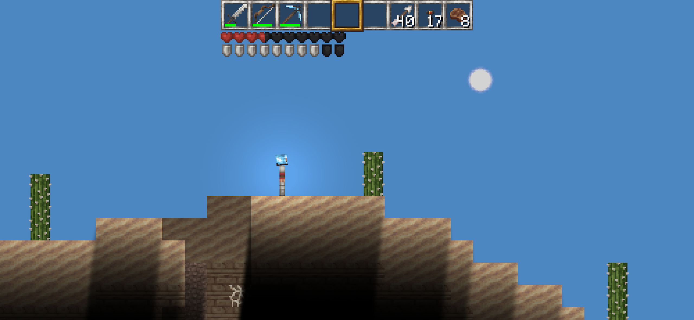
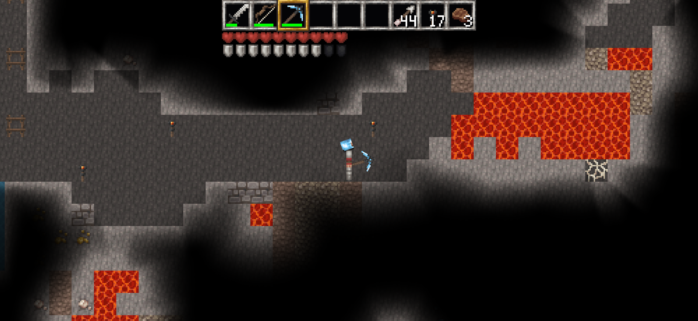

[English](README.md) | [Русский](README-RU.md)


[](https://github.com/fredboy/cavedroid/actions/workflows/android.yml)
[](https://github.com/fredboy/cavedroid/actions/workflows/ktlint.yml)
[](https://github.com/fredboy/cavedroid/tags)

CaveDroid — это **2D-игра в стиле Minecraft** для Android, Desktop (Windows, Linux, macOS) и потенциально iOS.
Исследуйте, добывайте и стройте в зацикленном мире.

<details>
  <summary>Скриншоты</summary>








</details>

---

## Возможности

- 2D-мир, зацикленный по горизонтали
- Крафт, добыча ресурсов и исследование
- Процедурно-генерируемый мир
- Кроссплатформенность: Android, Desktop (Windows/Linux/macOS), iOS (не тестировалось)
- Однопользовательский режим (мультиплеер пока не доступен)

---

## Управление

| Действие | Сенсор / Мобильное | Клавиатура / Мышь |
|----------|--------------------|------------------|
| Движение влево/вправо | Тянуть **джойстик** на левой половине экрана | **A / D** |
| Прыжок | Нажать на левую часть или кнопку прыжка | **Пробел** (прыжок в воздухе в творческом режиме = полёт) |
| Движение курсора / прицеливание | Тянуть на правой стороне | Двигать **мышь** |
| Ломать блок | Удерживать на правой стороне | **ЛКМ** при наведении на блок |
| Разместить блок (задний слой) | Удерживать справа при наведении на пустую ячейку | **ПКМ** при наведении на пустое место |
| Активировать / Использовать / Разместить активный блок | Нажать справа | **ПКМ** |
| Атака моба | Нажать при наведении на моба | **ЛКМ** |
| Открыть инвентарь | Кнопка сундука | **E** |
| Инвентарь: взять / переместить | Drag-n-drop, нажатие | Клик для взять, ПКМ для половины стака или размещения по одному предмету |
| Инвентарь: переместить один предмет (сенсор) | Удерживать предмет одним пальцем + тапнуть по ячейке другим | Н/Д |

---

## Готовые сборки

APK и JAR сборки можно скачать на [странице релизов](https://github.com/fredboy/cavedroid/releases).

---

## Инструкции по сборке

### Android

```bash
./gradlew android:assembleDebug
```

### Desktop

```bash
./gradlew desktop:dist
```

В Windows используйте `gradlew.bat` вместо `./gradlew`, но сборка может упасть из-за симлинков для ассетов, потребуется небольшая доработка.

## Настройка keystore для подписывания

Чтобы собрать релиз Android и включить задачу `desktop:generateSignedJar`, необходим файл `keystore.properties` в корне проекта.

Создайте файл `keystore.properties` со следующим содержимым:

```properties
# Путь к вашему Java keystore
releaseKeystorePath=/path/to/your/keystore.jks

# Пароль от keystore
releaseKeystorePassword=yourKeystorePassword

# Алиас ключа
releaseKeyAlias=yourKeyAlias

# Пароль для ключа
releaseKeyPassword=yourKeyPassword
```

---

## Лицензия

### Код
CaveDroid распространяется под лицензией **MIT**. Подробнее см. [LICENSE](LICENSE).

### Ассеты

- **Текстуры**: Pixel Perfection от XSSheep, лицензия [CC BY-SA 4.0](https://creativecommons.org/licenses/by-sa/4.0/)
- **Экранный джойстик**: CC-0 с [OpenGameArt.org](https://opengameart.org/content/mmorpg-virtual-joysticks)
- **Шрифт**: LanaPixel от eishiya, лицензия [CC BY 4.0](https://creativecommons.org/licenses/by/4.0/)
- **Скрипты**: Разные скрипты с Stack Overflow, распространяются под соответствующими лицензиями

Лицензированные ассеты содержат файл `attribution.txt` с нужными упоминаниями.

---

## Вклад в проект

Мы приветствуем вклад в проект! Пожалуйста, создавайте issues или pull requests для предложений, исправлений ошибок или улучшений.
