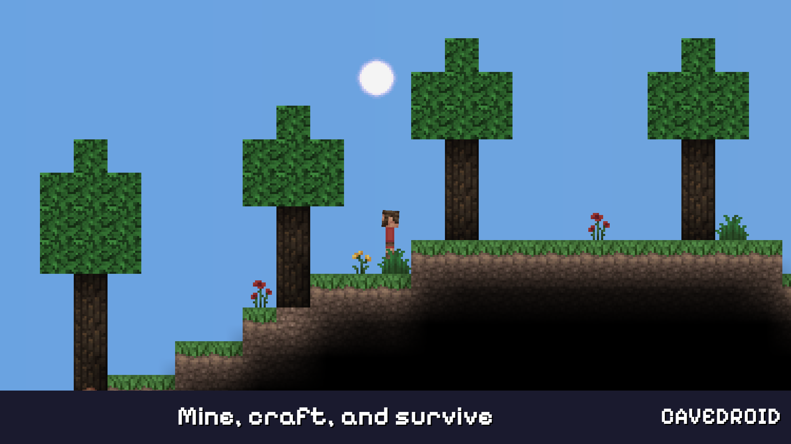
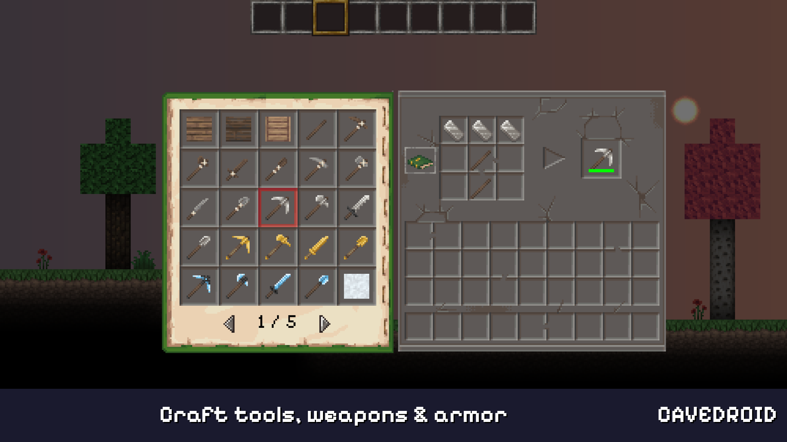
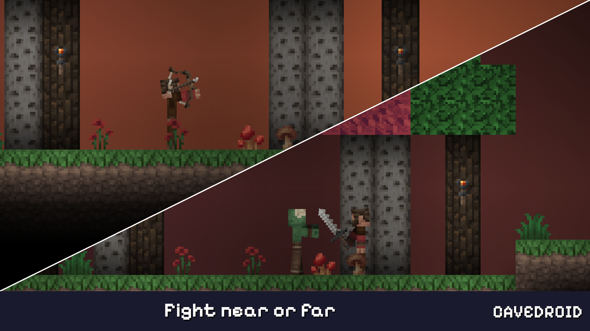
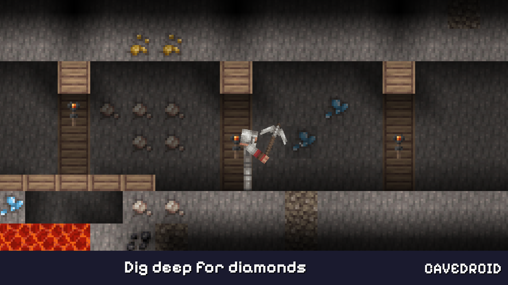
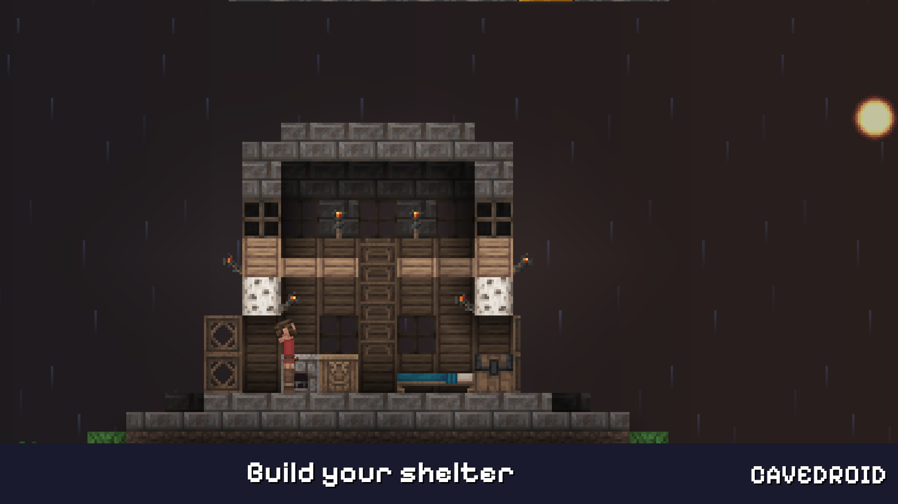
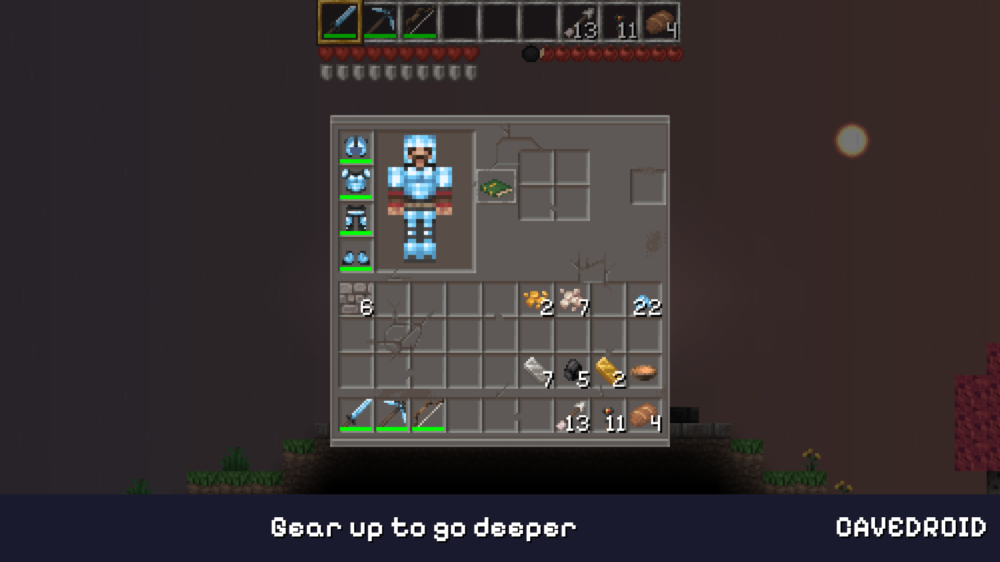

[English](README.md) | [Русский](README-RU.md)


[](https://github.com/fredboy/cavedroid/actions/workflows/android.yml)
[](https://github.com/fredboy/cavedroid/actions/workflows/desktop.yml)
[](https://github.com/fredboy/cavedroid/actions/workflows/html.yml)
[](https://github.com/fredboy/cavedroid/actions/workflows/ktlint.yml)
[](https://github.com/fredboy/cavedroid/releases)

CaveDroid — это **2D-игра в стиле Minecraft** для Android, Desktop (Windows, Linux, macOS), Web (браузер) и потенциально iOS.
Исследуйте, добывайте и стройте в зацикленном мире.

<details>
  <summary>Скриншоты</summary>








</details>

---

## Возможности

- 2D-мир, зацикленный по горизонтали
- Крафт, добыча ресурсов и исследование
- Процедурно-генерируемый мир
- Кроссплатформенность: Android, Desktop (Windows/Linux/macOS), Web (браузер, через TeaVM), iOS (не тестировалось)
- Однопользовательский режим (мультиплеер пока не доступен)

---

## Управление

| Действие | Сенсор / Мобильное | Клавиатура / Мышь |
|----------|--------------------|------------------|
| Движение влево/вправо | Тянуть **джойстик** на левой половине экрана | **A / D** |
| Прыжок | Нажать на левую часть или кнопку прыжка | **Пробел** (прыжок в воздухе в творческом режиме = полёт) |
| Движение курсора / прицеливание | Тянуть на правой стороне | Двигать **мышь** |
| Ломать блок | Удерживать на правой стороне | **ЛКМ** при наведении на блок |
| Разместить блок (задний слой) | Удерживать справа при наведении на пустую ячейку | **ПКМ** при наведении на пустое место |
| Активировать / Использовать / Разместить активный блок | Нажать справа | **ПКМ** |
| Атака моба | Нажать при наведении на моба | **ЛКМ** |
| Открыть инвентарь | Кнопка сундука | **E** |
| Инвентарь: взять / переместить | Drag-n-drop, нажатие | Клик для взять, ПКМ для половины стака или размещения по одному предмету |
| Инвентарь: переместить один предмет (сенсор) | Удерживать предмет одним пальцем + тапнуть по ячейке другим | Н/Д |

---

## Готовые сборки

APK и JAR сборки можно скачать на [странице релизов](https://github.com/fredboy/cavedroid/releases).

---

## Инструкции по сборке

### Android

```bash
./gradlew android:assembleFossDebug
```

### Desktop

```bash
./gradlew desktop:dist
```

В Windows используйте `gradlew.bat` вместо `./gradlew`, но сборка может упасть из-за симлинков для ассетов, потребуется небольшая доработка.

### Web (браузер)

CaveDroid компилируется в JavaScript через [gdx-teavm](https://github.com/xpenatan/gdx-teavm). Освещение в веб-сборке
использует упрощённый день/ночь tint-шейдер (без точечных источников света от блоков) — в остальном геймплей соответствует
desktop-сборке.

```bash
# Запуск локально со встроенным dev-сервером Jetty (с source maps, без обфускации)
./gradlew html:runWeb

# Сборка dev-бандла без запуска сервера
./gradlew html:buildJs

# Сборка релизного бандла (обфускация, полная оптимизация)
./gradlew html:buildJsRelease

# Упаковать релизный бандл (build/dist/cavedroid-web-<version>.zip) для статического хостинга
./gradlew html:packageWebDist
```

Релизный zip можно распаковать на любом статическом веб-хостинге (GitHub Pages, S3, Netlify, …) — серверная часть не требуется.

### Старые Android-устройства (API 16/17 — Jelly Bean)

> **⚠️ Экспериментально / нестабильно.** APK для старых устройств публикуются на
> [странице релизов](https://github.com/fredboy/cavedroid/releases) — ищите сборки с меткой
> `legacy` (или похожей). Они выкладываются «как есть» для пользователей с Android 4.1/4.2.
> Эта конфигурация понижает libGDX на шесть лет и три минорных версии: код собирается,
> нативы загружаются на API 16, но поведение в рантайме **не** входит в стандартный QA —
> Scene2D-вёрстка, порядок контактов Box2D и дефолты смешивания цветов могут заметно
> отличаться от основной сборки. Ожидайте шероховатостей, заводите issue при проблемах и
> не рассчитывайте на совместимость файлов сохранений с основной сборкой.

По умолчанию сборка использует `minSdk = 23`. Нативные библиотеки libGDX 1.12+, с которыми
поставляется CaveDroid, обращаются к символам Bionic (`__memcpy_chk`), отсутствующим до
Android 4.3 (API 18) — поэтому на более старых устройствах они не загружаются с ошибкой
`SharedLibraryLoadRuntimeException: Couldn't load shared library 'gdx'`.

Сборка под API 16/17 требует понижения libGDX до 1.9.10 (последний релиз, чьи нативы для
Android не ссылаются на проблемный символ) и согласованных версий ktx / box2dlights, а также
правки нескольких мест в коде, использующих API, появившиеся в libGDX 1.10–1.11.

Полная миграция закоммичена в корень репозитория как `legacy-migration.patch`. Чтобы собрать
legacy-вариант:

```bash
git apply legacy-migration.patch
./gradlew :android:assembleFossDebug   # либо assembleFossRelease

# Проверьте, что в нативных библиотеках нет проблемного символа — каждая строка должна вывести 0:
for arch in armeabi-v7a arm64-v8a x86 x86_64; do
    echo -n "$arch: "; strings android/libs/$arch/libgdx.so | grep -c __memcpy_chk
done

git restore -SW :/                     # вернуть рабочее дерево в mainline после сборки APK
```

`git apply` может упасть (`--check` сообщит о конфликте), если mainline с момента генерации
патча затронул один из файлов миграции. В таком случае патч устарел и подлежит
перегенерации — не правьте hunks вручную. Снова пройдите процедуру миграции и перезапишите
патч командой `git diff > legacy-migration.patch` перед откатом рабочего дерева.

Если вы работаете в этом репозитории через Claude Code, навык
`cavedroid-legacy-android-build` автоматизирует всё описанное: применяет валидный патч,
перегенерирует его при дрейфе mainline и запускает шаг проверки. Активируйте навык, попросив
собрать под Android 4.1/4.2 или вставив краш-лог с `__memcpy_chk`. Полный чек-лист (что
именно содержит патч и почему) — в файле
`.claude/skills/cavedroid-legacy-android-build/SKILL.md`.

## Настройка keystore для подписывания

Чтобы собрать релиз Android и включить задачу `desktop:generateSignedJar`, необходим файл `keystore.properties` в корне проекта.

Создайте файл `keystore.properties` со следующим содержимым:

```properties
# Путь к вашему Java keystore
releaseKeystorePath=/path/to/your/keystore.jks

# Пароль от keystore
releaseKeystorePassword=yourKeystorePassword

# Алиас ключа
releaseKeyAlias=yourKeyAlias

# Пароль для ключа
releaseKeyPassword=yourKeyPassword
```

---

## Лицензия

### Код
CaveDroid распространяется под лицензией **MIT**. Подробнее см. [LICENSE](LICENSE).

### Ассеты

- **Текстуры**: Pixel Perfection от XSSheep, лицензия [CC BY-SA 4.0](https://creativecommons.org/licenses/by-sa/4.0/)
- **Экранный джойстик**: CC-0 с [OpenGameArt.org](https://opengameart.org/content/mmorpg-virtual-joysticks)
- **Шрифт**: LanaPixel от eishiya, лицензия [CC BY 4.0](https://creativecommons.org/licenses/by/4.0/)
- **Скрипты**: Разные скрипты с Stack Overflow, распространяются под соответствующими лицензиями

Лицензированные ассеты содержат файл `attribution.txt` с нужными упоминаниями.

---

## Вклад в проект

Мы приветствуем вклад в проект! Пожалуйста, создавайте issues или pull requests для предложений, исправлений ошибок или улучшений.
