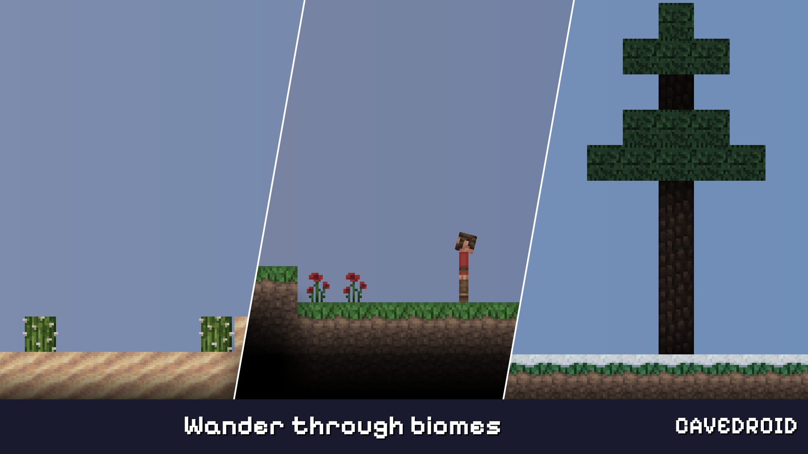

[English](README.md) | [Русский](README-RU.md)


[](https://github.com/fredboy/cavedroid/actions/workflows/android.yml)
[](https://github.com/fredboy/cavedroid/actions/workflows/desktop.yml)
[](https://github.com/fredboy/cavedroid/actions/workflows/html.yml)
[](https://github.com/fredboy/cavedroid/actions/workflows/ktlint.yml)
[](https://github.com/fredboy/cavedroid/releases)

CaveDroid is a **2D Minecraft-inspired game** for Android, Desktop (Windows, Linux, macOS), Web (browser), and potentially iOS.
Explore, mine, and build in a looped world.

<details>
  <summary>Screenshots</summary>




</details>

---

## Features

- 2D world, looped horizontally
- Craft, mine, and explore
- Procedurally generated world
- Cross-platform: Android, Desktop (Windows/Linux/macOS), Web (browser, via TeaVM), iOS (untested)
- Single-player mode (multiplayer not available yet)

---

## Controls

| Action | Touch / Mobile | Keyboard / Mouse |
|--------|----------------|-----------------|
| Move left/right | Drag **joystick** on left half | **A / D** |
| Jump | Tap left side or press **jump button** | **Space** (jump mid-air in Creative = fly) |
| Move cursor / aim | Drag on right side | Move **mouse** |
| Break block | Hold right side | **LMB** while aiming at block |
| Place block (background layer) | Hold right side while aiming empty cell | **RMB** while aiming empty space |
| Activate / Use / Place active block | Tap right side | **RMB click** |
| Attack mob | Tap while aiming at mob | **LMB click** |
| Open inventory | Chest button | **E** |
| Inventory: pick up / move | Drag-n-drop, tap | Click to pick up, Right-click for half stack or place single item |
| Inventory: move single item (touch) | Hold item with one finger + tap target cell with another | N/A |

---

## Download

<p>
  <a href="https://play.google.com/store/apps/details?id=ru.fredboy.cavedroid">
    
  </a>
</p>


You can also download APK and JAR builds from [the releases page](https://github.com/fredboy/cavedroid/releases).
Or play right from your browser [on GitHubPages](https://fredboy.github.io/cavedroid).

---

## Build Instructions

### Android

```bash
./gradlew android:assembleFossDebug
```

### Desktop

```bash
./gradlew desktop:dist
```

On Windows, use `gradlew.bat` instead of `./gradlew`, though it will fail because of symlinks used to reference assets
directory, so some tweaks are required.

### Web (browser)

CaveDroid compiles to JavaScript through [gdx-teavm](https://github.com/xpenatan/gdx-teavm). Lighting on the web build
uses a simplified day/night tint shader (no per-block light sources) — gameplay is otherwise at parity with the desktop
build.

```bash
# Run locally with the embedded Jetty dev server (source maps, no obfuscation)
./gradlew html:runWeb

# Build a development bundle without serving
./gradlew html:buildJs

# Build the obfuscated, fully-optimized release bundle
./gradlew html:buildJsRelease

# Zip the release bundle (build/dist/cavedroid-web-<version>.zip) for static hosting
./gradlew html:packageWebDist
```

The release zip can be unpacked under any static web host (GitHub Pages, S3, Netlify, …) — no server-side runtime required.

### Legacy Android devices (API 16/17 — Jelly Bean)

Unstable, experimental APKs for Android 4.1/4.2 are published on the
[releases page](https://github.com/fredboy/cavedroid/releases) — look for builds tagged
`legacy` (or similar). Provided as-is, outside the regular QA pass.

## Setting up the keystore for signing

To build an android release and enable the `desktop:generateSignedJar` task for release builds,
you need a `keystore.properties` file in the root of the project.

Create a file named `keystore.properties` with the following properties:

```properties
# Path to your Java keystore file
releaseKeystorePath=/path/to/your/keystore.jks

# Keystore password
releaseKeystorePassword=yourKeystorePassword

# Alias of the key to use
releaseKeyAlias=yourKeyAlias

# Password for the key
releaseKeyPassword=yourKeyPassword
```

---

## License

### Code
CaveDroid is licensed under the **MIT License**. See [LICENSE](LICENSE) for details.

### Assets

- **Textures**: Pixel Perfection by XSSheep, licensed under [CC BY-SA 4.0](https://creativecommons.org/licenses/by-sa/4.0/)
- **On-screen joystick**: CC-0 from [OpenGameArt.org](https://opengameart.org/content/mmorpg-virtual-joysticks)
- **Font**: LanaPixel by eishiya, licensed under [CC BY 4.0](https://creativecommons.org/licenses/by/4.0/)
- **Scripts**: Various scripts from Stack Overflow are distributed under their applicable licenses

Licensed assets have an `attribution.txt` file in their directories with applicable attributions.

---

## Contributing

Contributions are welcome! Please open issues or pull requests for suggestions, bug fixes, or improvements.
